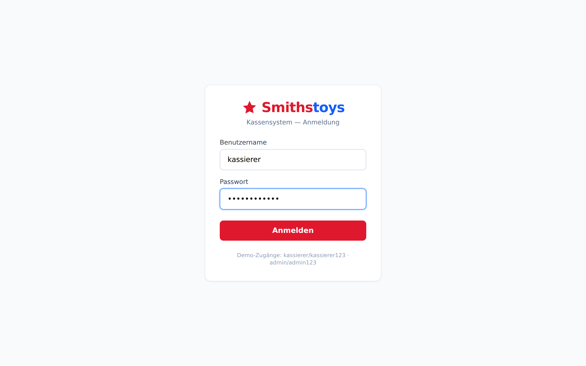
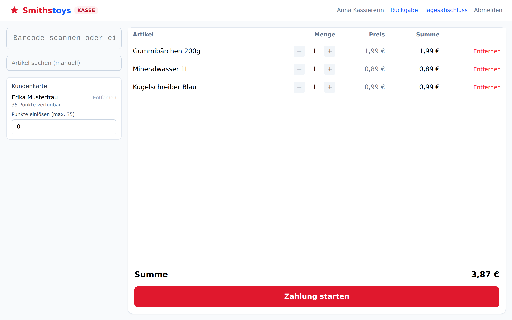
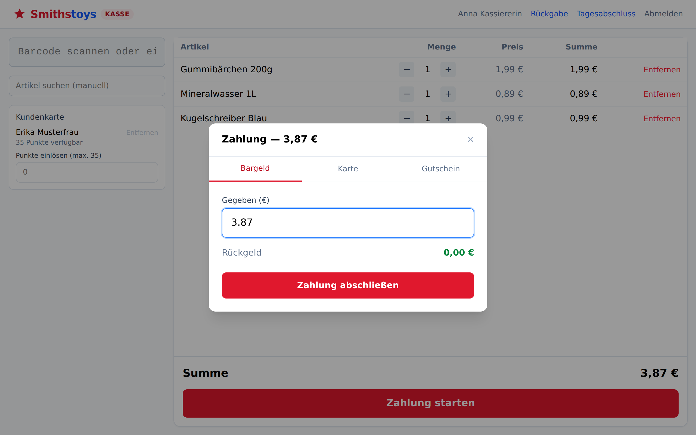
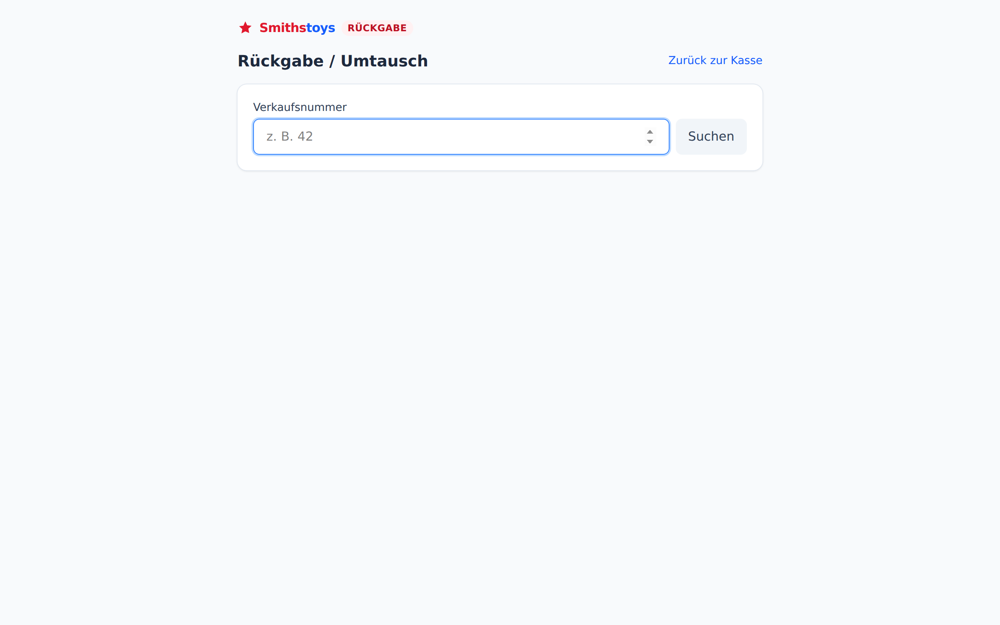
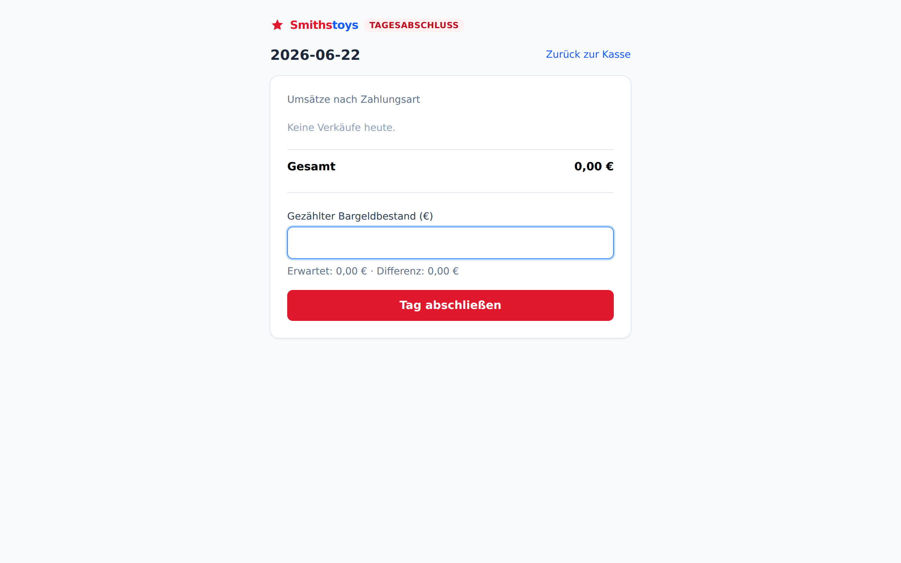
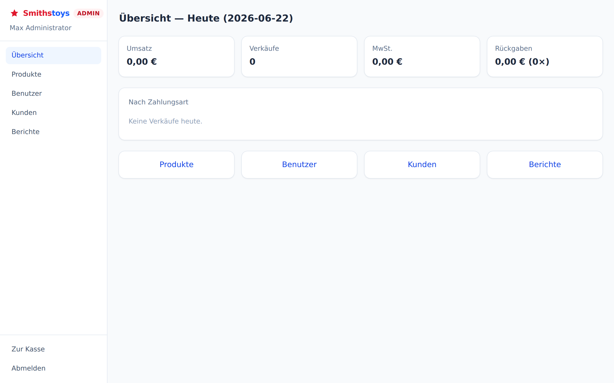
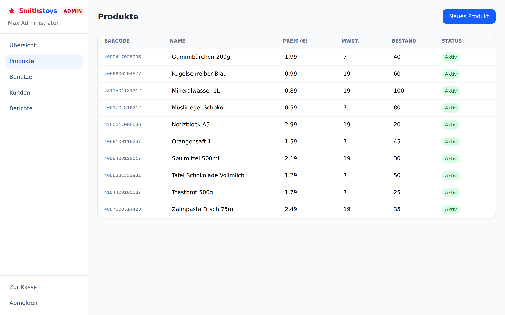

# Cash-register

Nachstellung von Smithstoys Kasse zum üben.

Ein Kassensystem (POS) mit zwei Bereichen: einem Kassierer-Interface (Barcode-Scan,
Warenkorb, Zahlung, Tagesabschluss, Rückgaben) und einem Admin-Bereich (Produkte,
Benutzer, Kunden, Berichte).

## Status: Phase 3

Umgesetzt (Phase 1):
- Login (JWT, Rollen `cashier`/`admin`)
- Barcode-Erfassung (Scanner-Eingabefeld + manuelle Suche als Fallback)
- Warenkorb mit Mengenänderung und Fehlerprävention (z. B. Bestandsprüfung)
- Zahlungsabwicklung: Bargeld (mit Rückgeldberechnung), Karte, Gutschein
- Tagesabschluss mit Soll-/Ist-Differenz

Umgesetzt (Phase 2):
- **Rückgaben/Umtausch**: Verkauf per Nummer nachschlagen, Artikel teilweise oder
  vollständig zurückgeben (mit Schutz gegen Mehrfach-Rückgabe pro Position), Erstattung
  per Bargeld, Karte (echte Stripe-Refund bzw. Mock) oder Gutschrift (neuer Gutschein-Code)
- **Kundenloyalität**: Kundenkarten mit Punktekonto, 1 Punkt pro bezahltem Euro, Einlösung
  von Punkten als Rabatt (1 Punkt = 1 Cent) direkt an der Kasse, serverseitig validiert
  gegen den aktuellen Punktestand
- **Admin-Dashboard**: eigener, rollengeschützter Bereich (`/admin`) mit Übersicht,
  Produktverwaltung (inline editierbare Tabelle + Neuanlage), Benutzerverwaltung
  (Anlegen/Deaktivieren, Schutz gegen Selbst-Deaktivierung), Kundenverwaltung und
  Verkaufsberichten (Tag/Woche/Monat, nach Zahlungsart, Topseller)

Umgesetzt (Phase 3):
- **Multi-Laden**: mehrere Standorte, vollständig getrennt — jeder Standort hat einen
  eigenen Lagerbestand pro Produkt (`product_stock`), eigene Tagesabschlüsse und isolierte
  Verkaufsdaten. Kassierer sind fest einem Standort zugeordnet, Admins sehen alle Standorte
  und können sie im Admin-Bereich verwalten (`/admin/locations`). Berichte lassen sich nach
  Standort filtern und zeigen zusätzlich einen Standortvergleich.
- **Split-Payment**: ein Verkauf kann auf mehrere Zahlarten aufgeteilt werden (z. B. teils
  Bargeld, teils Karte) — die Kasse summiert die Teilbeträge und prüft, dass sie den
  Gesamtbetrag exakt decken.
- **Mobile-Payments**: neue Zahlart „Mobile/Wallet“ neben Bargeld, Karte und Gutschein,
  mit eigenem Tab im Zahlungsdialog. Läuft im selben deterministischen Testmodus wie die
  Kartenzahlung (ohne Stripe-Schlüssel) oder optional über echte Stripe-PaymentIntents.

Bewusste Vereinfachungen:
- **SQLite** statt PostgreSQL (dateibasiert, kein Serverbetrieb nötig)
- **Produktsuche per SQL** statt Elasticsearch (für den Katalogumfang einer Einzelkasse ausreichend)
- **Karte & Mobile/Wallet**: echte Stripe-PaymentIntent-Integration (inkl. Refunds), die
  aktiv wird, sobald `STRIPE_SECRET_KEY` / `VITE_STRIPE_PUBLISHABLE_KEY` gesetzt sind. Ohne
  Schlüssel läuft ein deterministischer Testmodus (Testkarte endet auf `0002` →
  Ablehnung, alles andere → Erfolg), damit die App ohne echtes Stripe-Konto lauffähig bleibt.
- **Multi-Laden**: Standorte werden flach verwaltet (kein Filialleiter-Rollenkonzept,
  keine Standort-zu-Standort-Umbuchungen von Bestand) — passend zum Übungsumfang.

## Screenshots

Kassierer-Ansicht (Phase 1 & 2):

| Anmeldung | Kasse (Warenkorb + Kundenkarte) | Bargeldzahlung |
| --- | --- | --- |
|  |  |  |

| Rückgabe / Umtausch | Tagesabschluss |
| --- | --- |
|  |  |

Admin-Bereich (Phase 2):

| Übersicht | Produktverwaltung |
| --- | --- |
|  |  |

## Tech-Stack

- Frontend: React 18 + TypeScript + Vite + TailwindCSS 4
- Backend: Node.js + Express + TypeScript + SQLite (`better-sqlite3`)
- Cache: Redis (optional — Caching/Scan-Debounce; App läuft auch ohne Redis weiter,
  dann direkt gegen die DB)
- Zahlungen: Stripe (PaymentIntents) mit Mock-Fallback

## Setup

### Backend

```bash
cd backend
npm install
cp .env.example .env
npm run seed   # legt Demo-Benutzer, Produkte und Gutscheine an
npm run dev    # http://localhost:4000
```

Demo-Zugänge nach dem Seed:
- Kassierer (Filiale Mitte): `kassierer` / `kassierer123`
- Kassierer (Filiale Nord): `kassierer2` / `kassierer123`
- Admin (alle Standorte): `admin` / `admin123`
- Kundenkarten (für Loyalität): `1001` (Erika Musterfrau, 35 Punkte), `1002` (Hans Beispiel, 0 Punkte)
- Gutscheine: `GUTSCHEIN10` (10 €), `GUTSCHEIN25` (25 €)

Redis ist optional. Falls installiert, einfach lokal starten (`redis-server`) — die
`REDIS_URL` aus `.env.example` zeigt standardmäßig auf `localhost:6379`. Ohne laufendes
Redis fällt der Server automatisch auf direkte DB-Zugriffe zurück.

### Frontend

```bash
cd frontend
npm install
cp .env.example .env
npm run dev    # http://localhost:5173
```

## Kostenlos hosten

Die App lässt sich als einzelne kostenlose Web-Instanz deployen (Backend liefert
das gebaute Frontend mit aus → eine öffentliche URL). Anleitung in
[`DEPLOY.md`](./DEPLOY.md). Im Repo liegt dafür ein fertiges Render-Blueprint
(`render.yaml`) für ein 1-Klick-Deployment.

## Projektstruktur

```
backend/
  src/
    config/     DB, Redis, Env-Konfiguration
    db/         SQLite-Schema + Seed-Skript
    middleware/ Auth (JWT), Error-Handling
    modules/    auth, products, sales, payments, closing, returns, customers, users,
                reports, locations
frontend/
  src/
    api/        Fetch-Client pro Domäne
    store/      Zustand (Auth, Warenkorb)
    components/ BarcodeScanner, Cart, PaymentModal, ProtectedRoute, AdminRoute
    pages/      Login, POS (Kasse), Tagesabschluss, Rückgabe
    pages/admin/ Layout, Übersicht, Produkte, Benutzer, Kunden, Standorte, Berichte
```
